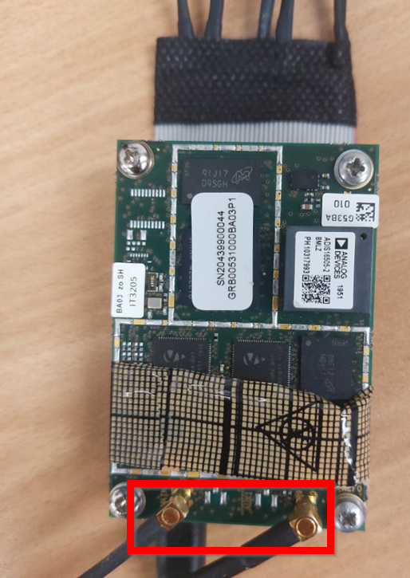
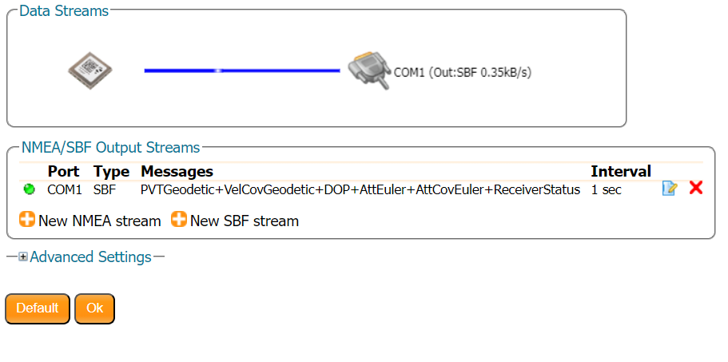

# Getting started with ArduPilot

## How to connect latest AsteRx OEM receivers with Pixhawk 4 using Robotics Interface board?

The steps below detail how to integrate a Pixhawk 4 with the latest generation AsteRx GNSS and INS receivers using a Robotics Interface Board (RIB). In this example, the setup is done in a lab environment using an AsteRx-m3 D receiver with RIB, without installing it on an actual UAS (Unmanned Aerial System). Please note that the procedure is same for AsteRx-i3 S and AsteRx-m3 receivers (with RIB kits).

The following materials are required for the integration:
* Windows Laptop/PC
* AsteRx GNSS OEM receiver
* Pixhawk 4
* Latest Mission Planner version installed on any Laptop/PC
* Dual-frequency GNSS antenna(s)
* Adapters and cables to interface with MMCX connectors
* 2 * Micro-USB cable

The integration encompasses the following steps:

### Step 1:
Make sure the receiver is powered with at least 3.3V. You can use the micro USB connector or the open ended supply (labeled "PWR & GND").

### Step 2:
Connect one or two GNSS antennas to the external antenna ports on the AsteRx Receiver board as shown in Figure 1.

  

### Step 3:
Now connect the AsteRx Receiver to the GPS MODULE port on the Pixhawk 4 as shown in Figure 2 and figure 3 depending on your receiver.

  

  

The cable should be wired as show in figure 4.

  

### Step 4:
On a Windows Laptop/PC, download and install Mission Planner from the Ardupilot Website. The drivers for the Pixhawk 4 will be installed, along with the Mission Planner software.

### Step 5: 

#### Download the firmware
From the [releases](https://github.com/septentrio-gnss/Septentrio-ArduPilot-Autopilot/releases) in this repository, download the assets corresponding to your setup (usually a .apj file). (To build the code for a specific target board, download the Source code and follow the [instructions](https://ardupilot.org/dev/docs/building-the-code.html) in the ArduPilot documentation).
#### Connect autopilot to computer
Once you have installed a ground station on your computer, connect the autopilot using the micro USB cable.

#### Select the COM port
If using Mission Planner as the GCS, select the COM port drop-down in the upper-right corner of the window near the Connect button. Select AUTO or the specific port for your board. Set the Baud rate to 115200 as shown. Do not hit Connect just yet.

  

#### Install firmware
In Mission Planner’s SETUP | Install Firmware screen click "Load custom firmware" and select the .apj file.

Mission Planner will try to detect which board you are using. It may ask you to unplug the board, press OK, and plug it back in to detect the board type.

If all goes well, you will see a status appear on the bottom right including the words: “erase…”, “program…”, “verify..”, and “Upload Done”. The firmware has been successfully uploaded to the board.

It usually takes a few seconds for the bootloader to exit and enter the main code after programming or a power-up. Wait to press CONNECT until this occurs.

### Step 6:
In Mission Planner, select the port corresponding to the Pixhawk 4 as shown in Figure 3 and then click connect (please
note that port enumeration will be different for different connections). Make sure the baudrate matches the one of the
receiver which is 115200 baud per default.

  

### Step 7:
After successfully connecting to the Pixhawk 4, select the "CONFIG" tab from the top and open the Full Parameter List (highlighted on the left in figure 4). Now search for "GPS_TYPE2" and set its value to 10 to select SBF as incoming data format, it will select the AsteRx receiver as the second GPS as shown in Figure 4.

Also make sure that the "SERIAL4_BAUD" parameter is set to 115 and that "SERIAL4_PROTOCOL" is configured as value 5 for
GPS as shown in Figure 5.

Finally, you can also switch off the Ardupilot automatic configuration by setting "GPS_AUTO_CONFIG" to 0 as shown below.

#### Dual antenna extra parameters
For dual antenna setup, modify the following settings :
* [AHRS_EKF_TYPE](https://ardupilot.org/copter/docs/parameters.html#ahrs-ekf-type) = 3 (to use EKF3)
* [EK2_ENABLE](https://ardupilot.org/copter/docs/parameters.html#ek2-enable) = 0 (to disable EKF2)
* [EK3_ENABLE](https://ardupilot.org/copter/docs/parameters.html#ek3-enable) = 1 (to enable EKF3)
* [EK3_MAG_CAL](https://ardupilot.org/copter/docs/parameters.html#ek3-mag-cal) is not used for this feature so it can be left at its default value (“0” for Plane, “3” for Copter, “2” for Rover)
* [EK3_SRC1_YAW](https://ardupilot.org/copter/docs/parameters.html#ek3-src1-yaw) = 2 (“GPS”) or 3 (“GPS with Compass Fallback”) if a compass(es) is also in the system
* [GPS_TYPE](https://ardupilot.org/copter/docs/parameters.html#gps-type) = 26 (SBF-Heading)

After applying all the above settings click on "Write Params" (on the right hand side of the screen in above figures) to
save the settings to memory.

### Step 8:
Now, open the receiver's webUI (or another interface) and define an SBF data stream on COM2 with an output rate of 10Hz for AsteRx-m3. In the webUI, you can do this via NMEA/SBF Out as shown in figure 7. 
#### Single antenna
For single antenna, the recommended SBF messages are "PVTGeodetic", "DOP", "VelCovGeodetic" and "ReceiverStatus".

#### Dual antenna
The recommended SBF messages for dual antenna are "PVTGeodetic", "VelCovGeodetic", "DOP", "AttEuler", "AttCovEuler" and "ReceiverStatus".

After this, you can save the current configuration in the non-volatile memory of the receiver to make sure that the
receiver does not lose its configuration after power cycling. It can be done by going Admin > Configurations and copying
the "current" config to "boot" as shown below.

### Step 9:
Now the Pixhawk 4 should be able to receive SBF data through serial COM2 port of the receiver. On the Flight Data
screen, the GPS2 status should now be displayed, along with a location indicator on the map. In this case, the screen
reports 3D Fix for GPS2 to indicate a standalone solution as shown in Figure 9.

To read more about injecting RTK corrections using Mission Planner, please go to this [article](https://customersupport.septentrio.com/s/article/How-to-inject-RTK-Corrections-into-an-AsteRx-UAS-receiver-via-Mission-Planner).

### Step 10 (Only for Dual antenna setup)

The attitude (heading/pitch) can be computed from the orientation of the baseline between the main and the aux1 GNSS antennas.

To enable multi-antenna attitude determination, follow the following procedure:

1. Attach two antennas to your vehicle, using cables of approximately the same length. The default antenna configuration is as depicted in the figure.
   It consists in placing the antennas aligned with the longitudinal axis of the vehicle, main antenna behind aux1.
   For best accuracy, try to maximize the distance between the antennas, and avoid significant height difference between the antenna ARPs.
2. In practice, the two antenna ARPs may not be exactly at the same height in the vehicle frame, or the main-aux1 baseline may not be exactly parallel or perpendicular to the longitudinal axis of the vehicle. This leads to offsets in the computed attitude angles.
   These offsets can be compensated for with the **setAttitudeOffset** command.

_For optimal heading results, the two antennas should be seperated by at least 30cm / 11.8 in (ideally 50cm / 19.7in or more)_

_For additional configuration of the dual antenna setup, please refer to
our [Knowledge Base](https://support.septentrio.com/l/858493/2022-04-19/xgrqd) or the [hardware manual](https://web.septentrio.com/l/858493/2022-04-19/xgrql)_

